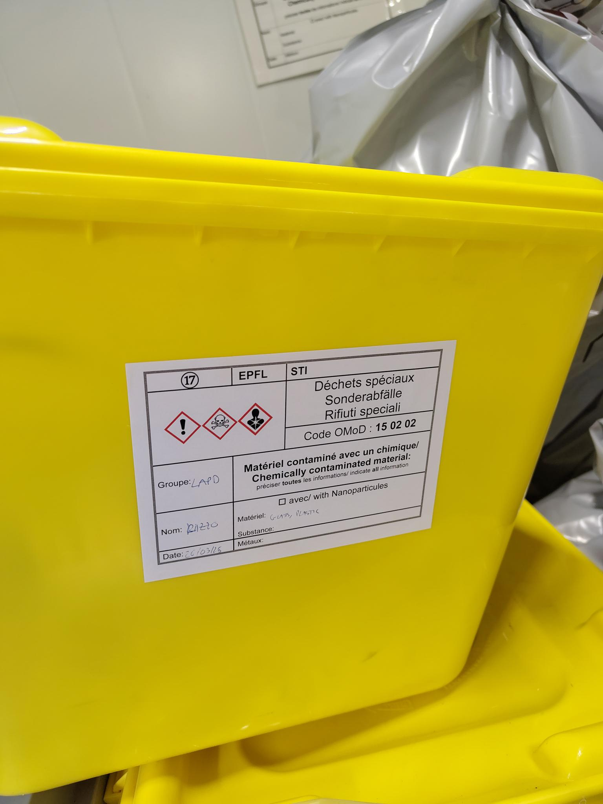
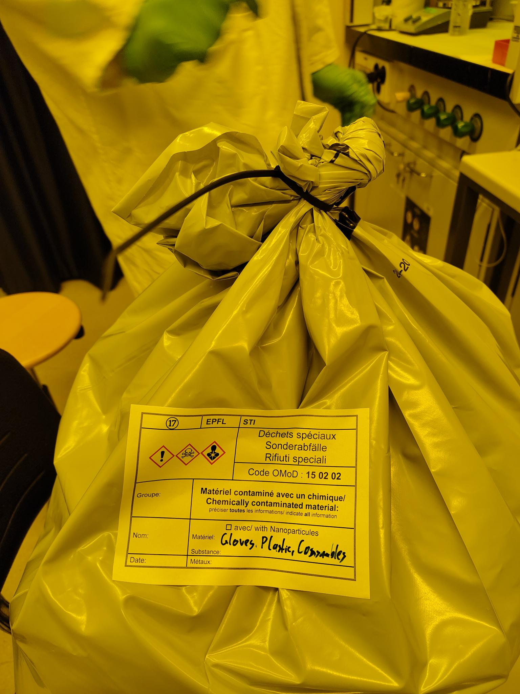
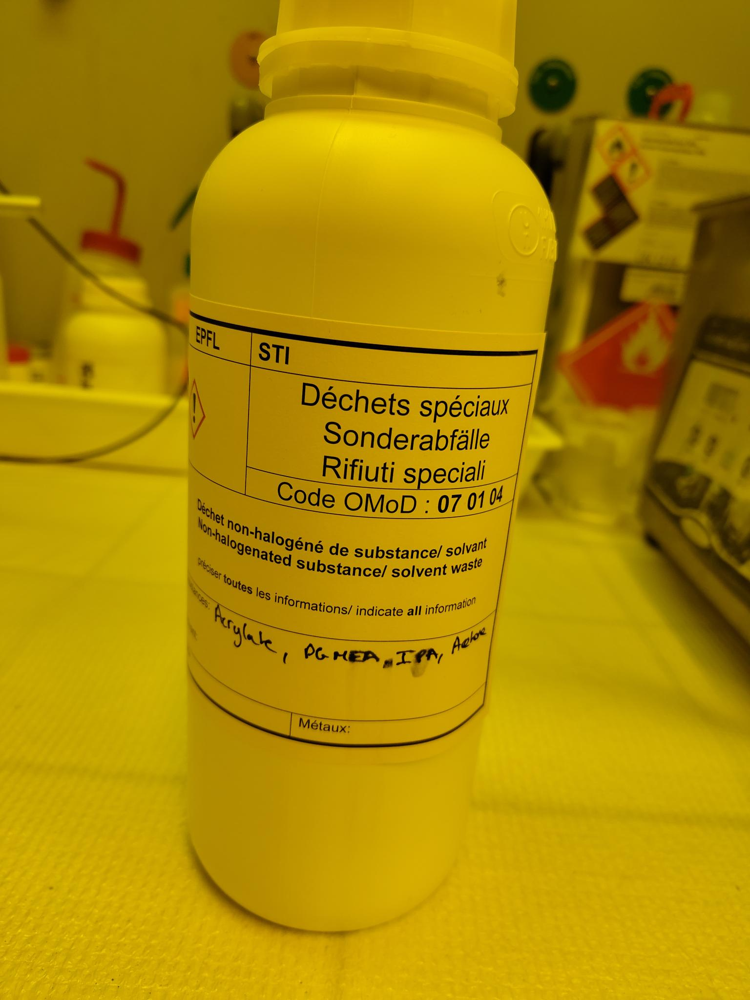
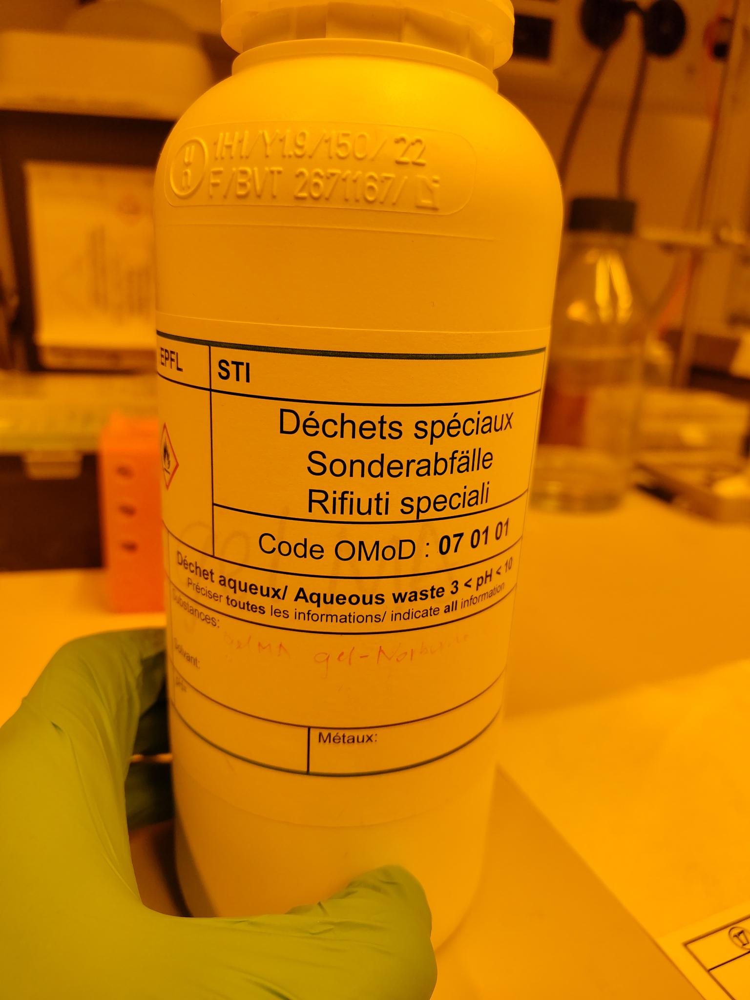

# Chemical-Waste-at-EPFL-STI-Microengineering

Currently, chemical waste is Thursday 10:30AM - 11:30AM.
See [here](https://www.epfl.ch/schools/sti/dechets/en/bm-2/)

Go there and bring the trash. Also bring new bags, containers if we need some new ones. We always should have labels in the lab, otherwise get new ones

## Glass waste
Glass with special waste (such as acrylate remainders)

  

## General waste
Fold the bags like on this picture. Close with zip tie

  

## Acrylate and solvent waste
  

## Aqueous waste
For this you have to measure the pH value with test stripes

  

